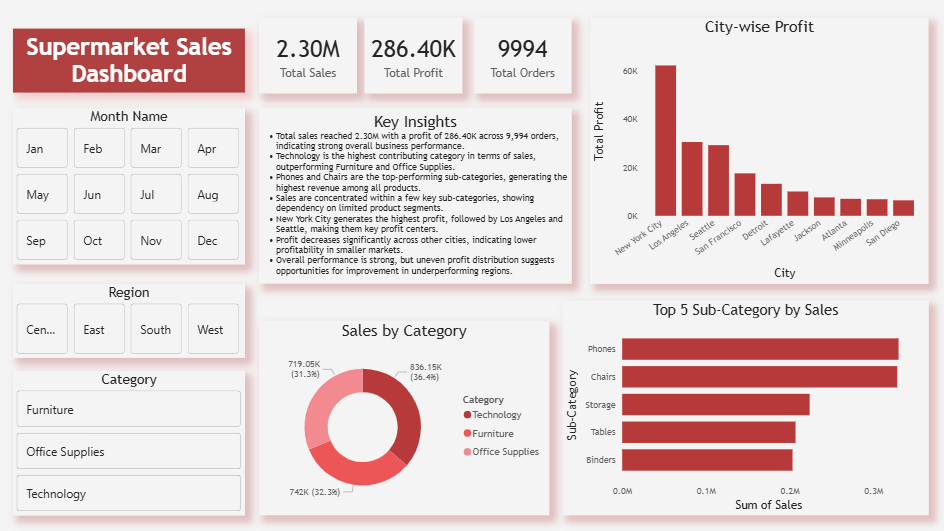

# Superstore Sales Analysis (Python + Power BI)

## Overview
This project analyzes retail sales data using Python (Pandas) for data cleaning and transformation, and Power BI for visualization.  
The goal is to identify key sales trends, category performance, and regional insights through an interactive dashboard.

## Tools Used
- Python (Pandas)
- Power BI

## Process
- Loaded raw Superstore dataset into Python
- Cleaned and prepared data using Pandas
- Handled data formatting (especially dates and columns)
- Exported cleaned dataset for Power BI
- Built an interactive dashboard for analysis

## Dashboard Features
- KPI cards for Total Sales, Total Profit, and Total Orders  
- Sales analysis by category (Technology, Furniture, Office Supplies)  
- Regional analysis (East, West, Central, South)  
- Top cities by profit  
- Top sub-categories by sales  
- Monthly filter for dynamic analysis  

## Key Insights
- Technology category contributes the highest share of total sales  
- New York City and Los Angeles are among the top-performing cities by profit  
- A few sub-categories drive a major portion of total sales  
- Sales distribution varies significantly across regions  
- Overall sales performance shows consistent trends with some fluctuations  

## Files in this Repository
- `data_cleaning.ipynb` → Python notebook for data preprocessing  
- `sales_data.csv` → Dataset used for analysis  
- `dashboard.pbix` → Power BI dashboard file  
- `images/dashboard.png` → Dashboard preview  

## Dashboard Preview

## Note
This project was created as part of my data analysis learning journey, focusing on using Python (Pandas) for data processing and Power BI for visualization.
